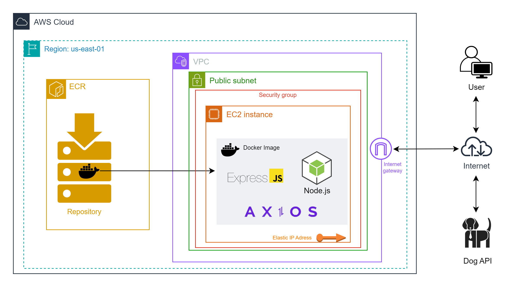

<h1 align="center"> Dog App 🐾 </h1>

## 📜 Descrição

Este é um projeto de uma aplicação web construída com Node.js e Express, que permite aos usuários buscar imagens aleatórias de raças de cães. A aplicação utiliza a API pública [Dog CEO](https://dog.ceo/dog-api/) para obter as imagens das raças de cães. O projeto também está configurado para ser executado em Docker e está hospeado na cloud AWS.


## ✅ Funcionalidades

- [x] **Buscar Imagens de Raças de Cães:** O usuário pode digitar ou selecionar uma raça de cão e obter uma imagem aleatória dessa raça.
- [x] **Auto-complete para Raças de Cães:** A aplicação oferece sugestões de raças de cães à medida que o usuário digita.
- [x] **Novo Design Responsivo**: Interface otimizada para diferentes dispositivos, com estilos modernos.


## 🧑‍💻 Como usar a Aplicação

**1. Para acesso a aplicação, copie qualquer um dos links abaixo e cole no navegador:**
```
http://54.209.135.120:3000 
  ```
```
http://44.219.183.152:3000
```
```
http://44.195.193.89:3000
```
```
http://52.7.58.93:3000
```
**2. Após acesso a aplicação, busque imagens de uma raça de Cão:**
- Digite ou selecione o nome de uma raça de cão no campo de entrada.
- Clique no botão "Pesquisar".
- Uma imagem aleatória da raça selecionada será exibida.

**3. Obter nova imagem da mesma raça:**
- Clique no botão "Nova Imagem" (se disponível) para obter outra imagem aleatória da mesma raça.

**4. Verificar erros:**
- Se a raça não for encontrada, uma mensagem de erro será exibida informando que a raça não está listada.

## 🚀 Desenvolvimento

**📂 Estrutura de pastas**

 ```
├── src
│   ├── controllers
│   │   ├── dogController.js      # Lógica para buscar imagens de cães
│   │   └── homeController.js     # Lógica para renderizar a página inicial
│   │
│   ├── middlewares
│   │   └── notFound.js           # Middleware para tratamento de erro 404
│   │
│   ├── public
│   │   └── styles.css            # Arquivo de estilos CSS
│   │
│   ├── routes
│   │   └── rotas.js              # Definição das rotas da aplicação
│   │
│   ├── templates
│   │   └── 404.ejs               # Template para página 404
│   │
│   └── views
│       └── index.ejs             # Template EJS para a página inicial
├── app.js                        # Código do servidor Node.js
│
├── docker-compose.yml            # Configuração do Docker Compose
│
├── Dockerfile                    # Configuração do Docker
│
├── package.json                  # Dependências do projeto
│
└── ipackage-lock.json            # Versões exatas das dependências
 ```

**⚙️ Tecnologias Utilizadas**

- **Node.js:**  Ambiente de execução JavaScript 
- **Express:** Framework web para Node.js.
- **EJS:** Motor de templates para renderização de páginas HTML.
- **Axios:** Cliente HTTP para fazer requisições à API.
- **Docker:** Para containerização da aplicação.
- **Docker Compose:** Para orquestração de containers Docker.


## 💻 Executar a aplicação localmente

**Pré-requisitos** :  
- `Node.js`  ou `Docker` e `Docker Compose`

**Passos para executar a aplicação**

- **Clone o repositório:**
```
git clone https://github.com/Compass-pb-aws-2024-ABRIL/sprints-2-3-pb-aws-abril.git
cd sprints-2-3-pb-aws-abril
 ```

- **Entre na branch:**
 ```
git checkout grupo-8
 ```
- **Caso prefira executar pelo node.js instale as dependências e rode o projeto:**
```
npm install
node app.js  
```

- **Ou caso prefira executar pelo docker faça o Build da imagem Docker e execute o container Docker:**
 ```
docker-compose build
docker-compose up
 ```

- **Acesse a aplicação localmente:**
Abra o navegador e vá para http://localhost:3000

## 🌐 Arquitetura AWS
- O passo a passo realizado para subir a aplicação para a AWS pode ser encontrado em: [Link](https://katfrd.notion.site/ECR-e-EC2-na-AWS-36efd2d1cf5943479d64c2982f3dfb59)
- A imagem abaixo exemplifica a arquitetura. A aplicação web foi empacotada como uma imagem Docker e armazenada em um repositório ECR, a imagem é puxada do ECR para a instância EC2. O usuário interage com a aplicação via internet por um endereço IPv4 público, e a aplicação faz requisições a uma API externa (Dog API) para obter dados. O Internet Gateway permite a comunicação entre a instância EC2 e a internet.



## 🔐 Dificuldades
- Instalação do Docker: Tivemos um caso de instalação do Docker em uma máquina local onde o kernel da WLS estava corrompido. Isso exigiu a reinstalação do Docker e a correção do kernel, o que atrasou um pouco.
- Configuração da AWS: Configurar a AWS para rodar a aplicação na nuvem apresentou desafios, especialmente na configuração correta do AWS EC2 para permitir o tráfego HTTP e SSH, bem como na gestão de permissões e segurança.

## 👨‍💻 Autores
<div>
  <table style="margin: 0 auto;">
    <tr>
      <td><a href="https://github.com/katfr"><br><sub>Katarina Lydia</sub></a></td>
      <td><a href="https://github.com/Layonj300"><br><sub>Layon Reis</sub></a></td>
      <td><a href="https://github.com/lloureiro2"><br><sub>Leonardo Loureiro</sub></a></td>
      <td><a href="https://github.com/ManoellaReis"><br><sub>Manoella Reis</sub></a></td>
    </tr>
  </table>
</div>

